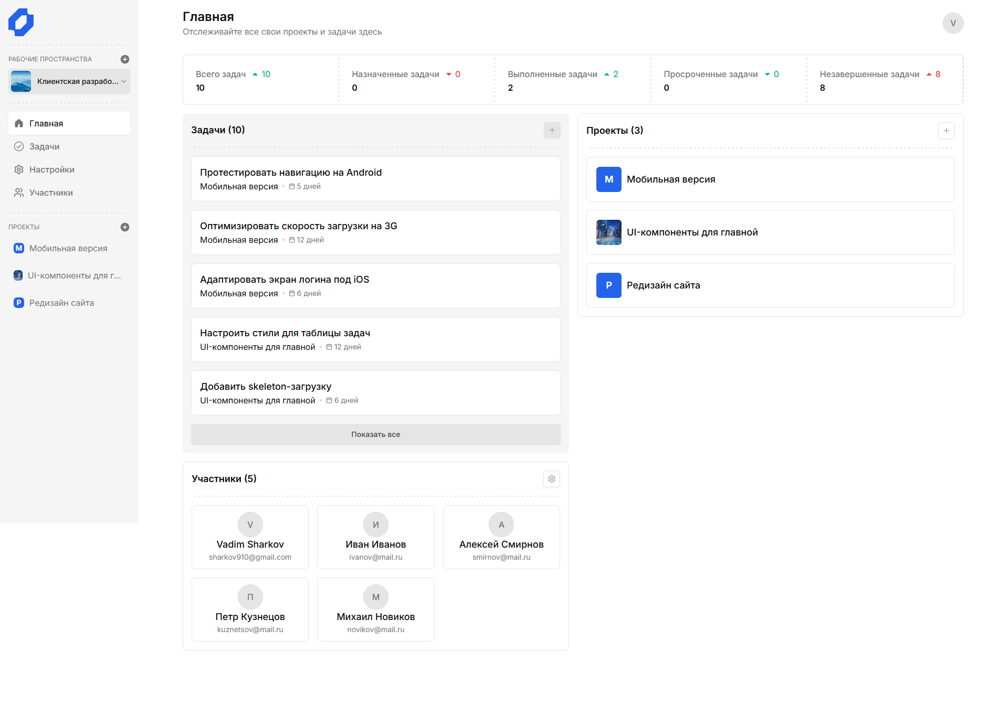
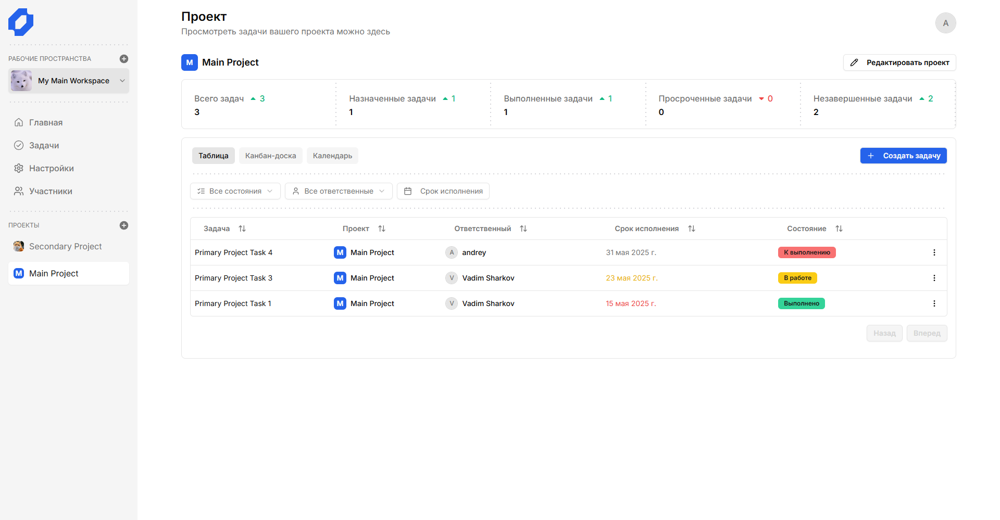
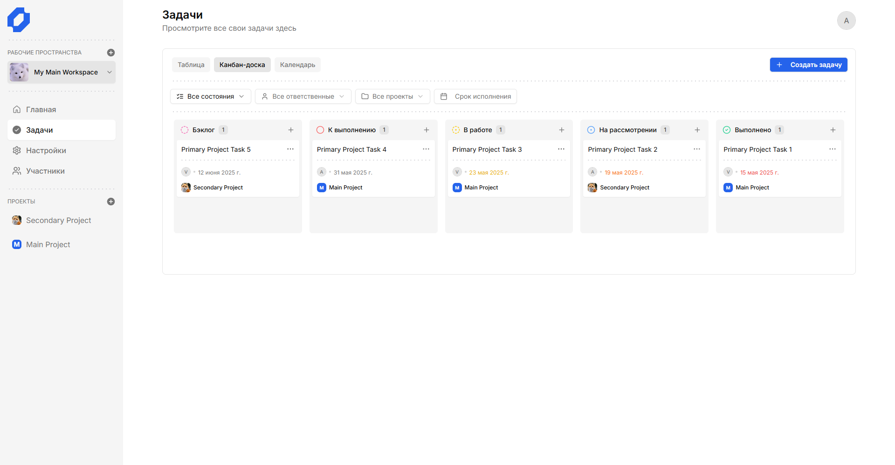
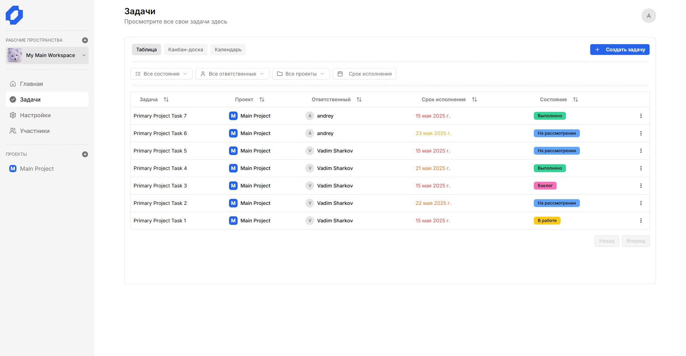
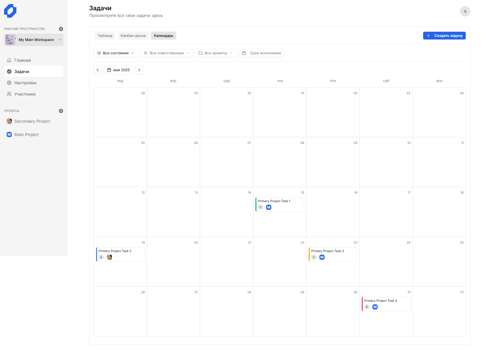
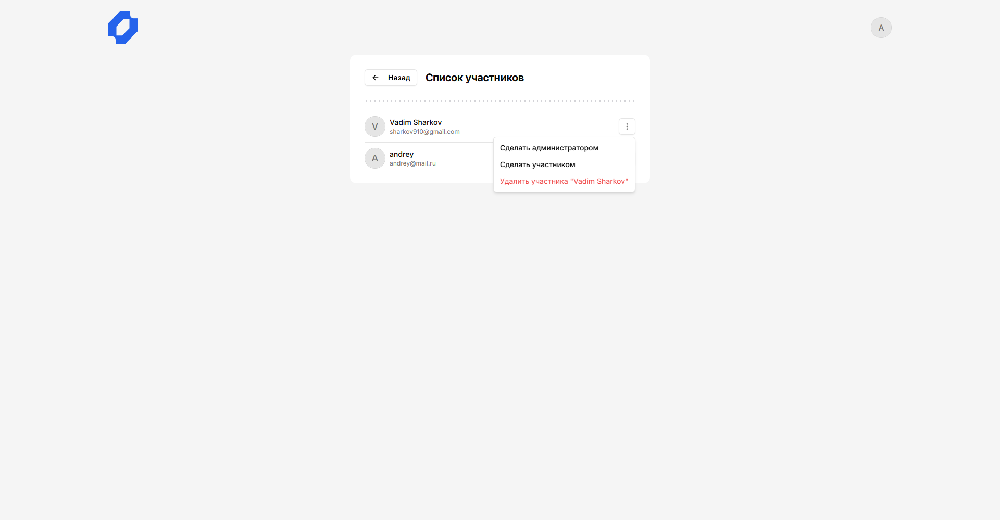
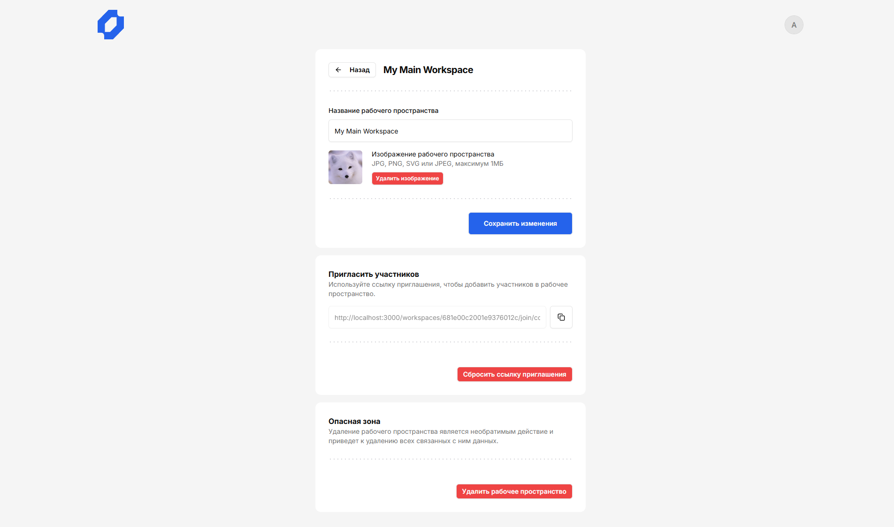

<h1 align="center">Team Planning App</h1>

  
*Веб-приложение для организации командной работы*

**Team Planning App** - это полноценное веб-приложение для управления задачами и проектами в командах. Проект выполнен в рамках дипломной работы и демонстрирует навыки разработки Full‑stack приложений на современном стеке: Next.js 14, TypeScript, Hono.js (API), Appwrite (BaaS), Tailwind CSS и shadcn/ui. Приложение поддерживает создание рабочих пространств, проектов, задач, управление участниками, различные представления (таблица, канбан‑доска, календарь) и аналитику.

[](https://team-planning-app.vercel.app/)

## 🛠 Технологии

<div align="center">
  
  
  
  
  
  
  
</div>

- **Frontend**: Next.js 14 (App Router), React, TypeScript, Tailwind CSS, shadcn/ui, TanStack Query.
- **Backend API**: Hono.js (REST API), Zod (валидация), middleware для сессий.
- **База данных и аутентификация**: Appwrite (Database, Storage, Account, OAuth).
- **Аутентификация**: JWT + OAuth 2.0 (Google, GitHub, Yandex).
- **Хостинг**: Vercel.
- **Дополнительно**: Drag-and-drop (@hello-pangea/dnd), календарь (react-big-calendar), графики (recharts), работа с датами (date-fns).

## ✨ Функциональность

- 👥 **Управление рабочими пространствами** - создание, редактирование, удаление, приглашение участников по ссылке.
- 📁 **Проекты** - создание проектов внутри рабочего пространства, настройка иконки, редактирование.
- 📋 **Задачи** - создание, редактирование, удаление, назначение ответственного, установка срока, статус (бэклог, к выполнению, в работе, на рассмотрении, выполнено).
- 🔄 **Три вида представления**:
  - Таблица - сортировка и фильтрация по статусу, проекту, ответственному, сроку.
  - Канбан‑доска - drag-and-drop для изменения статуса и порядка задач.
  - Календарь - просмотр задач по датам.
- 📊 **Аналитика** - метрики по задачам: общее количество, назначенные, выполненные, просроченные, незавершённые с динамикой относительно предыдущего месяца.
- 👤 **Управление участниками** - назначение ролей (администратор/участник), удаление участников.
- 🔐 **Аутентификация** - вход/регистрация по email/паролю, а также через Google, GitHub, Yandex.
- 🎨 **Адаптивный интерфейс** - корректное отображение на мобильных устройствах (меню выезжает из боковой панели).

## 📸 Скриншоты

| Дашборд рабочего пространства | Канбан‑доска |
|-------------------------------|--------------|
|  |  |

| Таблица задач | Календарь |
|---------------|-----------|
|  |  |

| Редактирование участников | Настройка пространства |
|------------------------|------------------------|
|  |  |

## 🔍 Особенности реализации

- **Next.js App Router** - использование серверных компонентов для начальной загрузки данных, клиентских для интерактива.
- **Hono.js API** - лёгкий фреймворк для создания API с типизацией и валидацией через Zod, встроенная поддержка middleware.
- **TanStack Query** - управление серверным состоянием, кэширование, инвалидация запросов.
- **Appwrite** - использован как BaaS для базы данных, хранилища изображений, аутентификации и OAuth.
- **Drag-and-Drop** - реализация канбан‑доски с помощью `@hello-pangea/dnd` с автоматической синхронизацией позиций задач.
- **Календарь** - интеграция `react-big-calendar` с локализацией на русский язык.
- **Адаптивность** - мобильная версия использует компонент `Sheet` (боковое меню), таблицы и канбан‑доска адаптируются под ширину экрана.
- **Валидация форм** - `react-hook-form` + Zod, кастомные сообщения об ошибках.
- **Модальные окна** - универсальный компонент `ResponsiveModal`, который переключается между `Dialog` (десктоп) и `Drawer` (мобильные) в зависимости от ширины экрана.
- **OAuth** - реализация потока OAuth 2.0 через Appwrite, перенаправление на страницу `/oauth` для установки сессии.

## 🧱 Структура проекта

```
team-planning-app/
├── .github/               # GitHub Actions (тесты, деплой)
├── public/                 # Статические файлы, изображения
├── src/
│   ├── app/                # Маршруты Next.js (App Router)
│   │   ├── (auth)/         # Страницы аутентификации (sign-in, sign-up)
│   │   ├── (dashboard)/    # Основной интерфейс после входа
│   │   ├── (standalone)/   # Страницы без бокового меню (приглашения, настройки)
│   │   ├── api/            # Hono API (сборка всех маршрутов)
│   │   └── ...
│   ├── components/         # Переиспользуемые UI-компоненты
│   │   ├── ui/             # Компоненты shadcn/ui
│   │   ├── analytics.tsx   # Блок аналитики
│   │   ├── navbar.tsx      # Верхняя панель
│   │   ├── sidebar.tsx     # Боковая панель
│   │   └── ...
│   ├── features/           # Функциональные модули (feature-sliced)
│   │   ├── auth/           # Аутентификация
│   │   ├── workspaces/     # Рабочие пространства
│   │   ├── projects/       # Проекты
│   │   ├── tasks/          # Задачи (три представления, хуки, API)
│   │   └── members/        # Участники
│   ├── hooks/              # Кастомные хуки (use-confirm)
│   ├── lib/                # Утилиты, настройка Appwrite, RPC-клиент
│   └── config.ts           # Переменные окружения
├── .env.example
├── next.config.mjs
├── package.json
├── tailwind.config.ts
└── README.md
```

## 🚦 Запуск проекта локально

```bash
# Клонируйте репозиторий
git clone https://github.com/CLoudXVII/team-planning-app.git

# Перейдите в папку проекта
cd team-planning-app

# Установите зависимости
npm install

# Создайте файл .env на основе .env.example и заполните переменные
cp .env.example .env

# Запустите проект в режиме разработки
npm run dev
```

После выполнения `npm run dev` проект будет доступен по адресу `http://localhost:3000`. Для работы приложения необходима учётная запись Appwrite и настройка базы данных, коллекций, бакетов и OAuth провайдеров. Подробные инструкции можно найти в документации Appwrite.

## 🎯 Цель проекта

Дипломная работа, направленная на разработку полноценного веб-приложения с нуля, охватывающего все этапы: анализ предметной области, проектирование базы данных, разработку клиентской и серверной частей, интеграцию с BaaS, настройку аутентификации, деплой.

## 📝 Что сделано мной

- Проектирование базы данных и архитектуры приложения.
- Разработка всех модулей:
  - аутентификация (email/пароль + OAuth);
  - управление рабочими пространствами, проектами, задачами;
  - три представления (таблица, канбан, календарь);
  - аналитика с динамикой;
  - управление участниками и ролями;
  - адаптивный интерфейс.
- Интеграция с Appwrite (база данных, хранилище, аутентификация).
- Настройка OAuth-провайдеров (Google, GitHub, Yandex).
- Реализация drag-and-drop канбан‑доски с синхронизацией позиций.
- Деплой на Vercel и настройка переменных окружения.
